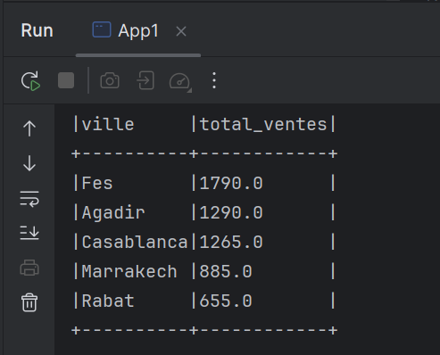
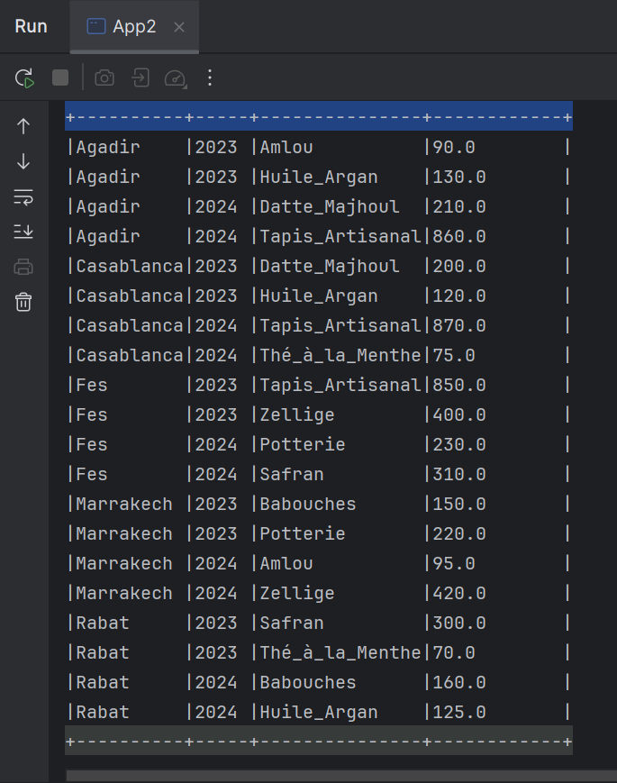
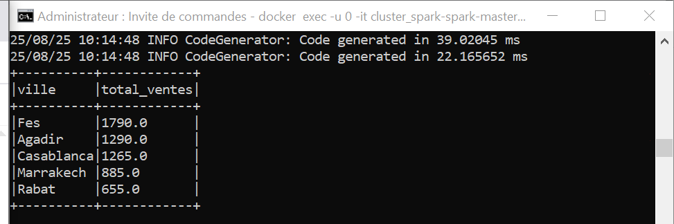
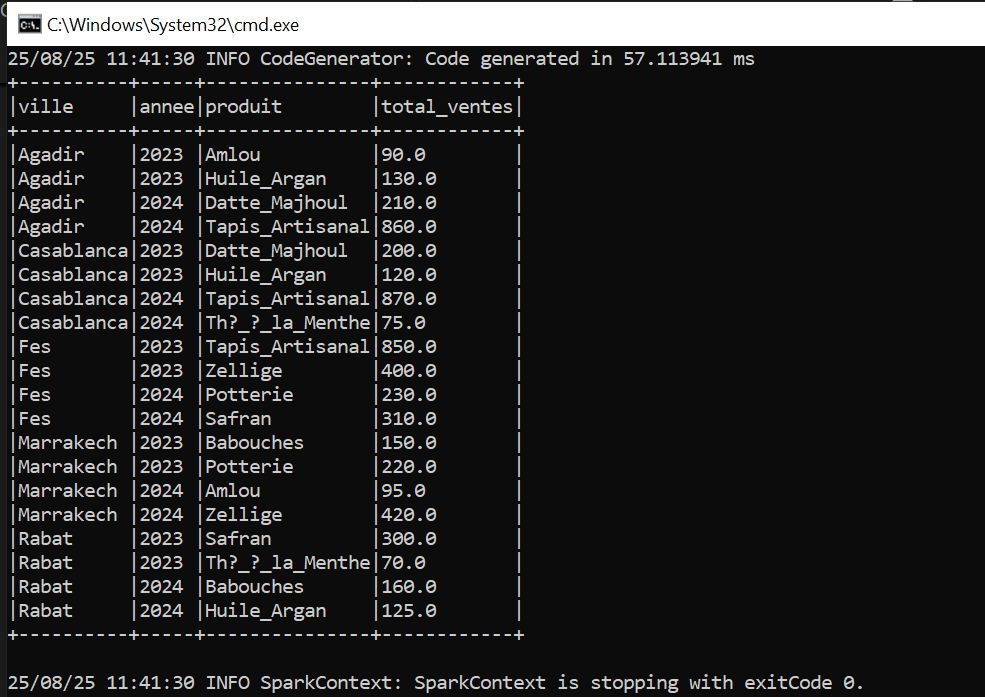

# TP — Traitement parallèle et distribué avec Apache Spark (Java)

Deux applications :
- **Exo 1 (`App1`)** : total des ventes **par ville**
- **Exo 2 (`App2`)** : total des ventes **par ville + année (+ produit)**

## Architecture

### Locale (test)
Driver + executors tournent dans la même JVM (`spark.master=local[*]`). Les données sont lues depuis le FS local.

### Cluster (Docker)
`spark-submit` est lancé dans le conteneur **spark-master** (mode client). Driver dans `spark-master`, executors sur les workers.
Les données et le JAR sont montés par volumes :
- `/shared/ventes.txt`
- `/opt/spark-apps/tp1-spark-1.0-SNAPSHOT.jar`

## Arborescence
```
spark-ventes-analyse/
├─ app/
│  ├─ pom.xml
│  └─ src/main/java/ma/enset/{App1.java, App2.java}
├─ shared/ventes.txt
└─ cluster_spark/docker-compose.yml
```

## Données d'exemple (`shared/ventes.txt`)
Format CSV avec en-tête (par défaut `sep=,`):
```
date,ville,produit,prix
07/08/25,Casablanca,TV,1200
07/08/25,Rabat,Laptop,800
08/08/25,Casablanca,Phone,600
08/08/25,Rabat,TV,400
```

## Build
```bash
mvn -f app/pom.xml clean package -DskipTests
```

## Exécution locale (IntelliJ)
Run configuration (Main class `ma.enset.App1` ou `ma.enset.App2`):
- VM options:
  - `-Dspark.master=local[*]`
  - `-Dinput=shared/ventes.txt`
  - `-Dsep=,`
  - `-DdatePattern=dd/MM/yy` (pour `App2` selon votre fichier)
- Working directory: racine du projet
- 
### Résultats locaux (captures d’écran)





## Cluster Docker
Démarrer le cluster :
```bash
cd cluster_spark
docker-compose up -d --force-recreate
cd ..
```

Vérifier volumes :
```bash
docker exec -it spark-master ls -l /opt/spark-apps
docker exec -it spark-master ls -l /shared
```

Soumettre Exo 1 :
```bash
docker exec -it spark-master /opt/bitnami/spark/bin/spark-submit   --master spark://spark-master:7077   --deploy-mode client   --class ma.enset.App1   --conf "spark.driver.extraJavaOptions=-Dinput=file:///shared/ventes.txt -Dsep=, -DdatePattern=dd/MM/yy"   /opt/spark-apps/tp1-spark-1.0-SNAPSHOT.jar
```

Soumettre Exo 2 :
```bash
docker exec -it spark-master /opt/bitnami/spark/bin/spark-submit   --master spark://spark-master:7077   --deploy-mode client   --class ma.enset.App2   --conf "spark.driver.extraJavaOptions=-Dinput=file:///shared/ventes.txt -Dsep=, -DdatePattern=dd/MM/yy"   /opt/spark-apps/tp1-spark-1.0-SNAPSHOT.jar
```

UI: http://localhost:8080

### Résultats cluster Spark (captures d’écran)





## Notes
- Adapter `-Dsep` si fichier à espaces: `-Dsep=" "` (un seul espace entre colonnes).
- Adapter `-DdatePattern` au format réel des dates.
- Les dépendances Spark sont en `provided` (fournies par le cluster).
